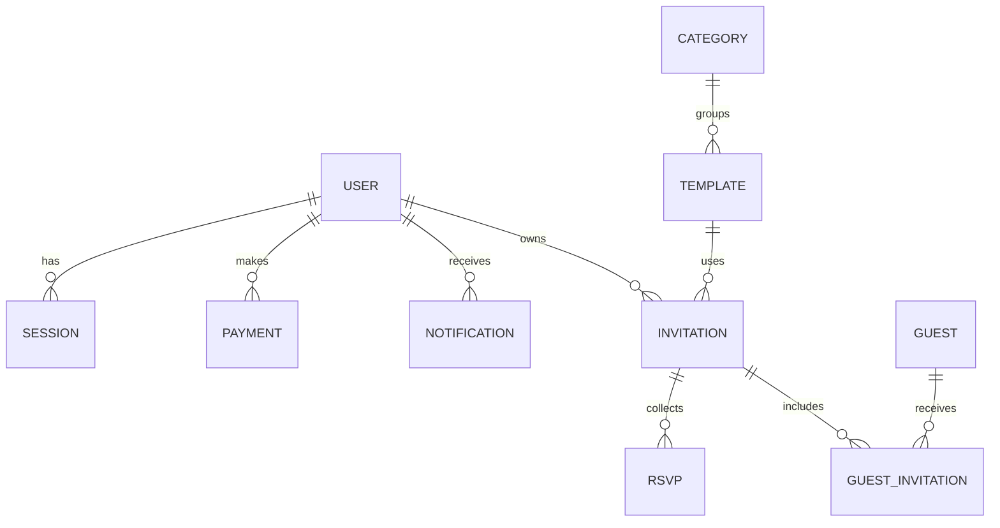

# ER Diagram

```mermaid
erDiagram
  USER ||--o{ INVITATION : owns
  USER ||--o{ NOTIFICATION : receives
  USER ||--o{ PAYMENT : makes
  USER ||--o{ SESSION : has
  CATEGORY ||--o{ TEMPLATE : groups
  TEMPLATE ||--o{ INVITATION : uses
  INVITATION ||--o{ GUEST_INVITATION : includes
  GUEST ||--o{ GUEST_INVITATION : receives
  INVITATION ||--o{ RSVP : collects
```
