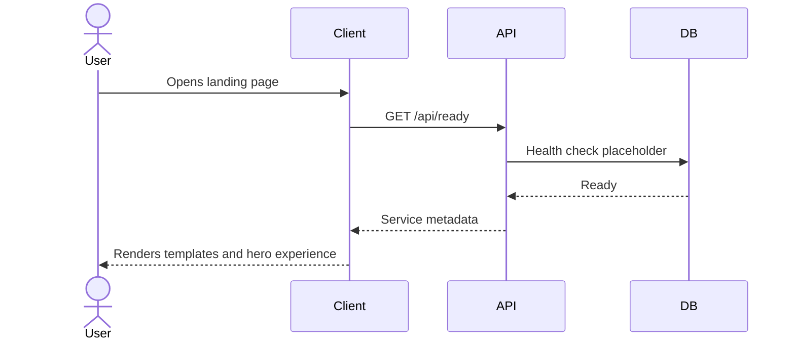

# Sequence Diagram

```mermaid
sequenceDiagram
  actor User
  participant Client
  participant API
  participant DB
  User->>Client: Opens landing page
  Client->>API: GET /api/ready
  API->>DB: Health check placeholder
  DB-->>API: Ready
  API-->>Client: Service metadata
  Client-->>User: Renders templates and hero experience
```
